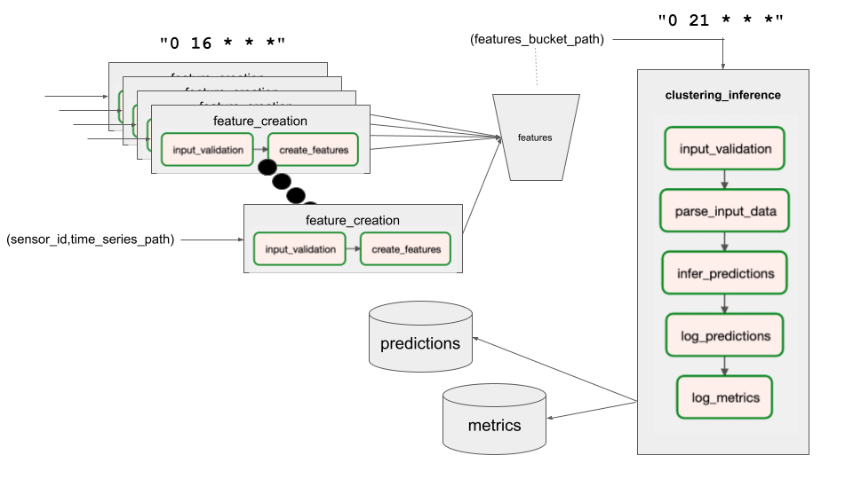

# beehero-ml-pipeline


# Main task:
a. How to run the entire flow

 - Clone the repository
 - Run the following
```bash
    cd beehero-ml-pipeline/pipeline
    docker compose up -d
    mkdir -p tests/sensor_features tests/ready_data_for_clustering tests/predictions
```
- This will make docker take care of all the necessary instalations to run airflow locally and simulate our pipeline
- Once it's done, I recommend running the following just to make sure airflow loads our DAGs:
```bash
    docker exec -it --user airflow airflow-scheduler bash -c "airflow dags list"
```
- You can access the airflow UI through `http://localhost:8080` to see al flows running.
- To simulate a simple pipeline you should run the file `integration_test.py`

b. How to access outputs and logs

- Folder `pipeline/tests/sensor_timeseries` contains already different timeseries divided by `sensor_id`
(these were extracted from the train_df that was given with the task).
- As soon as the test is ran, the directory `pipeline/tests/sensor_features` will contain the output of the feature engineering model per sensor.
- In `pipeline/tests/ready_data_for_clustering` will contain the aggregation of all of this data, ready to feed to the clustering algorithm
- `pipeline/tests/predictions` will contain the output of said model.
- `pipeline/tests/logs` contain two files. `results_db.txt` is a text file that simulates a db for storing the results of the clustering algorithm.
`metrics_db.txt` does the same but for storing the metrics of retraining the clustering algorithm and inferring new clusters.
- Directory `pipeline/models` contains different versions of the clustering and feature models. The pipeline always takes the latest one.
A new clustering model results from running the retrain_model pipeline (this is triggered at the end of the tests).


# Design
The whole pipeline is modeled around [Apache Airflow](https://airflow.apache.org/docs/apache-airflow/stable/howto/index.html) orchestration tool. A local version is packed inside of a Docker compose. 
Everything was coded using Python 3.9. To interact with the airflow webservice that is created, a REST API is used. My sample take on the orchestration is found in the `integration_test.py` file. The wrapper functions for these are found in the `airflow_api.py` file.
<br/>
<br/>
Although the implementation might be a bit simple, the main advantage of this design is that its **highly scalable** and components can be changed or further-developed easily respecting CI/CD principles.
The skeleton is provided, basically. If, for example, we want to start using S3 instead of text files in a directory, then its just a matter of developing the wrapper and and changing a couple of lines in the relevant task.

The design centers around 3 main [DAGs](https://airflow.apache.org/docs/apache-airflow/stable/howto/index.html): 
- **feature_creation**: responsible for loading a specific sensor's timeseries and transforming it into features by using the feature transformation model. Several instances of this DAG will be ran, one per sensor.
This DAG is also responsible for getting the latest version of the feature creation model from a model repository.
<br />It's triggered using a crontab: __everyday at 16:00hs__. Using the `sensor_id` as parameter and the path to the time series, it will dump the result of the model labeled with the sensor id into a bucket.
<br />Currently, in this simulation, the bucket and the repository are represented as simple directories.
<br />In the tests, the DAG is simply triggered manually: it doesn't wait for the crontab manager.
<br />There are 2 tasks in this DAG:
  - input_validation: empty currently. This would be the place were we validate or clean the data.
  - create_features: this task is responsible for getting the last feature creation model, transforming the data and storing the features in a bucket.<br />

- **clustering_inference**: responsible for aggregating all the features in the bucket and then outputting the cluster labels and the relevant metrics.
<br /> Only one instance of this DAG will be run. This would happen __daily at 21:00hs__ by crontab. Uses the bucket path for features as a parameter.
Currently the bucket is represented as a directory and in the test the DAG is triggered manually (it doesn't wait for the crontab manager).
There are 5 tasks in this DAG:
  - input_validation: empty currently. This would be the place were we validate or clean the data.
  - parse_input_data: gets the contents of the bucket, concats the csv files into one dataframe and stores the new csv in another specific bucket: `ready_data_for_clustering`
  - infer_predictions: this gets the latest clustering model, retrieves the data for clustering from `ready_data_for_clustering` and generates the predictions. <br/>
  Also DS metrics are calculated here: as an example I added **silhouette_score**, **calinski_harabasz_score** & **davies_bouldin_score**.
  - log_predictions: here we log the cluster predictions into our DB. Here i'm simulating this with a text file.
  - log_metrics: here we log the metrics into our DB. I'm also adding an infra metric here: **duration of the learning process**. Here i'm simulating this with a text file.

- **retrain_model**: responsible for retraining the clustering model. Currently, this is only run from a manual trigger. 
Only one instance should be run per DAG run. It doesn't have trigger parameters, although this could be improved. It takes data from the `ready_data_for_clustering` bucket and uses it for training.
The current criteria is using the latest data to retrain. It outputs the relevant metrics.
<br/> There are tasks in this DAG:
  - input_validation: empty currently. This would be the place were we validate or clean the data.
  - parse_input_data: this method only selects the latest data in the bucket.
  - retrain_model: this gets the latest data from the bucket, the last clustering model from the model repository, trains the model, stores it in the repository and pushes relevant metrics.
    Also DS metrics are calculated here: as an example I added **silhouette_score**, **calinski_harabasz_score** & **davies_bouldin_score**.
  - log_metrics: here we log the metrics into our DB. I'm also adding an infra metric here: **duration of the learning process**. Here i'm simulating this with a text file.


## This is the whole picture


## Metrics that would be worth adding

  - Any DS metric used for clustering is fair game. I didn't want to expand too much on that subject, since it may very well be the data scientist decision which one to monitor. I added a couple as a POC though:
      - Silhoutte score: The Silhouette Score and Silhouette Plot are used to measure the separation distance between clusters. It displays a measure of how close each point in a cluster is to points in the neighbouring clusters. This measure has a range of [-1, 1]
      - Calinski-Harabasz Index: also known as the Variance Ratio Criterion. The score is defined as the ratio between the within-cluster dispersion and the between-cluster dispersion. The C-H Index is a great way to evaluate the performance of a Clustering algorithm as it does not require information on the ground truth labels.
      - Davies-Bouldin Index: defined as the average similarity measure of each cluster with its most similar cluster. Similarity is the ratio of within-cluster distances to between-cluster distances. In this way, clusters which are farther apart and less dispersed will lead to a better score. The minimum score is zero, and differently from most performance metrics, the lower values the better clustering performance.  The higher the Index, the better the performance.
  - Infra metrics that I believe could be interesting to monitor:
    - Duration of training process
    - Duration of inference process
    - Duration of transformation of features
    - Model (weights) size
    - Dataset sizes (`ready_data_for_clustering` and every time series)
    - Amount of models in each repository
    - Amount of rows per sensor_id
    - Mean amount of rows
    - Amount of sensors
    - Time since last retrain (model age)
    - If models were wrapped in learning services (__will elaborate further down__):
      - Memory consumption of the model
      - Lag in delivering predictions
      - Error rate

# Notes

Further improvements I would've included are detailed in this part.<br/> <br/>
Given more time I would've definitely added triggers instead of working with crontabs.
If we already know the bucket address to where a timeseries will be uploaded, we can have an observer trigger pointing there. This way we could start a feature creation pipeline as soon as the data is available.
Same thing when all sensors are done for the day. As soon as all `feature_creation` pipelines have finished, only then we should start the clustering pipeline.<br/> <br/>
Instead of using a directory and a text file (which is, of course, only ok in a POC) we could use [Amazon S3](https://aws.amazon.com/pm/serv-s3/). Another good solution for this would be [HDFS (Hadoop Distributed File System)](https://hadoop.apache.org/docs/r1.2.1/hdfs_design.html).<br/>
For this we should properly define the paths where we were to store the files: they should include noth the date and the sensor id.<br/>
Both of these systems could be used too as a **model repository**. <br/>

This would be a great improvement too. By using a model repository we could run a pipeline with any model version we want, not just the latest one.
A specific version of a model could be a parameter in launching any of these DAGs. We would have to define a retention rule for which how back we want to store models so as not to fill up our space quota to easily (storage is cheap in these systems but production model weights could go up to several GBs)

Predictions could be store in a proper database and not in a textfile. [Redshift](https://aws.amazon.com/redshift/) could be a good solution, if cost is no issue. 
If not AWS offers a cheaper option: [RDS](https://aws.amazon.com/rds/). Redshift is superior in several aspects: data storage limit, scalability, availability of data formats and support of serverless.
Google Cloud Platform offers another product similar to Redshift: [BigQuery](https://cloud.google.com/bigquery)

I would use [Prometheus](https://prometheus.io/) which is a great monitoring solution for storing metrics. 
Prometheus works amazingly with [Grafana](https://grafana.com/) for dashboard crafting.

A huge part was left without discussing: the business decision of **when to retrain models**. <br/>
Currently in this pipeline, this is done manually and using the latest dataset available. Maybe the decision of retraining an online model is left to Data Scientists, but my recommendation would be to start doing this via a crontab.
First step would be doing this periodically: maybe every 3 days? Instead of taking the latest data from the bucket, 
the retrain DAG could be refactored to receiving as a parameter the location of a specific dataset prepared by the Data Scientist with relevant data (maybe not ALL data received is worth feeding into the model). <br/>
I believe the next step with this would be taking the model into **online learning**. 
A learning service would be developed so that as new data becomes available, it feeds into the existing model and a new fresh model would be produced via **incremental training**.
Every new model would be uploaded to our previously mentioned model repository. If we have different models, each one of them could have their own service instance running in a dedicated [Kubernetes](https://kubernetes.io/) pod.
Communication with the service would happen via a REST API, e.g. training or predicting.

Also, a process to clean up data and old models should be designed but this is beyond the scope of this task.

If suddenly long processing times start becoming an issue, a solution we could implement would be to have more than one instance of the clustering pipeline.
Let's say we have 100 sensors triggering 100 `feature_creation` pipelines. These pipelines are lagging and taking more than usual.
Instead of having only 1 instance of `clustering_inference`, we could have multiple. For the purposes of illustrating, let's imagine 5 instances. <br/>

As soon as 20 (100 `feature_creation` / 5 `clustering_inference`) DAGs are done, we would launch the first `clustering_inference` pipeline using the data from those first 20 `feature_creation` ones. <br/>
Then the second batch of 20 is done, and we have 40 `feature_creation` pipelines finished. We then launch the second `clustering_inference` process with those 40.

The third process is launched with 60, the fourth with 80 and the fifth with 100. As soon as each of these is finished, results will be reported.
This way we would get partial results faster. Although we wouldn't get the complete idea until the end, this may prove enough until everything is eventually processed.
This solution is also highly customizable.

